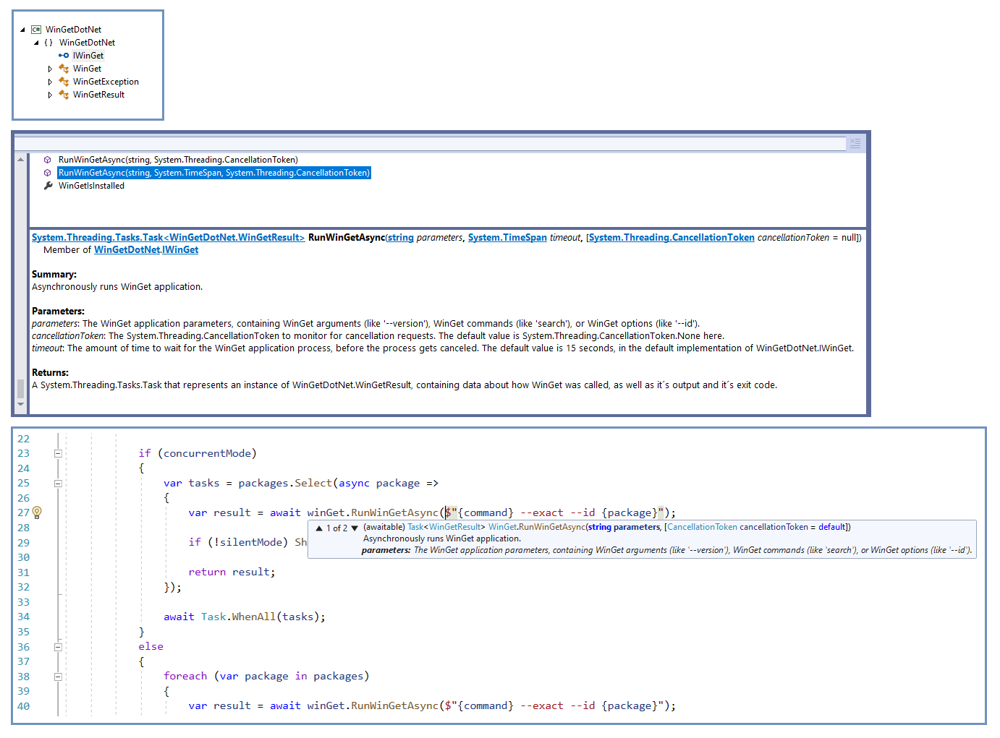

# WinGetDotNet
Some easy-to-use [_WinGet_](https://docs.microsoft.com/en-us/windows/package-manager/winget) wrapper library for .NET



### What it is
It´s a simple and tiny .NET 6 assembly named `WinGetDotNet`. The library wraps the popular Windows-App [_WinGet_](https://docs.microsoft.com/en-us/windows/package-manager/winget). _WinGet_ is used to manage software packages on a Windows machine. `WinGetDotNet` makes it easy, to integrate _WinGet_ into a .NET program.

`WinGetDotNet` is specifically designed with the [KISS principle](https://en.wikipedia.org/wiki/KISS_principle) in mind. It´s sole purpose is just to wrap the _WinGet_ application process calls. Nothing else.

Btw: _WinGet_ is imo a __fantastic__ piece of software, to manage all of your Windows applications and keep your Windows software up2date. Fat kudos :thumbsup: to Microsoft here!  For more information about _WinGet_ itself, take a look at https://docs.microsoft.com/en-us/windows/package-manager/winget or use your Google-Fu techniques.

### How it works
- `WinGetDotNet` is using the _System.Diagnostics.Process_ class, to run WinGet.
- `WinGetDotNet` is using the typical TAP pattern approach and supports task cancellation by using the _CancellationToken_ pattern.
- `WinGetDotNet` 

### The library
```
bool WinGetIsInstalled { get; }
```
```
Task<WinGetResult> RunWinGetAsync(string parameters, CancellationToken cancellationToken = default)
```
```
Task<WinGetResult> RunWinGetAsync(string parameters, TimeSpan timeout, CancellationToken cancellationToken = default)
```


### Requirements
There are not any special requirements, besides having _WinGet_ installed on your machine. `WinGetDotNet` is just a typical .NET assembly, released as NuGet package. Just download the newest release, from the [Releases](https://github.com/MBODM/WinGetDotNet/releases) page, unzip and add the NuGet package to your project. All the releases are compiled for x64 Windows, assuming you are using some 64-bit Windows (and that's quite likely).

### Notes
- `WinGetDotNet` is written in C#, is using .NET 6 and is built with Visual Studio 2022.
- To compile the source by your own, you just need some Visual Studio 2022 edition. Nothing else.
- I never compiled this with other tools, like Rider or VS Code. I only used Visual Studio 2022 Community.
- The release-binaries are compiled as _self-contained_ .NET 6 NuGet packages, with "_x64 Windows_" as target.
- _Self-contained_: That´s the reason why the binary-size may be bigger and why there is no framework dependency.
- GitHub´s default _.gitignore_ excludes Visual Studio 2022 publish-profiles, so i added a [screenshot](img/screenshot-publish-settings.png) to repo.
- The source is using some typical asynchronous TAP pattern approach, including stuff like _async/await_ etc.
- `WinGetDotNet` just exists, because it started as a sidecar project of my  [wingetupd](https://github.com/MBODM/wingetupd) project. :grin:

#### Have fun.

